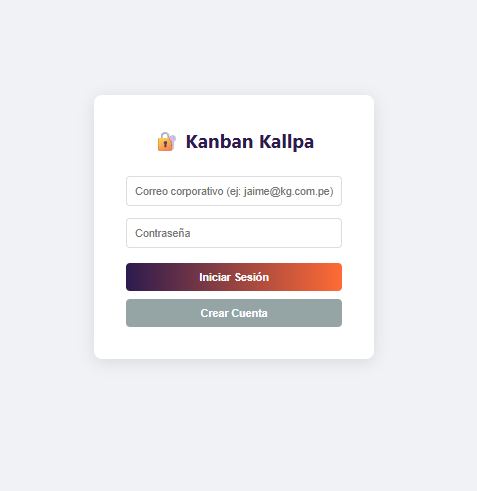
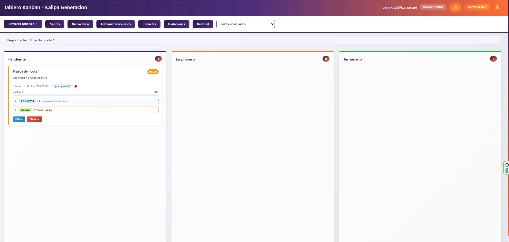
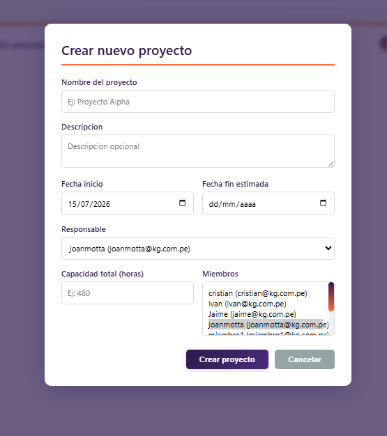
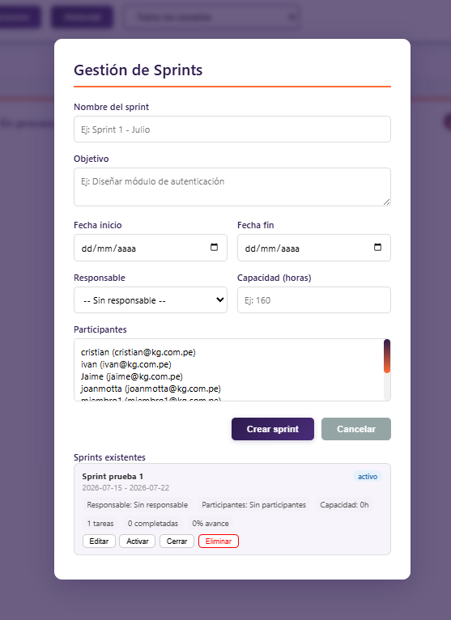
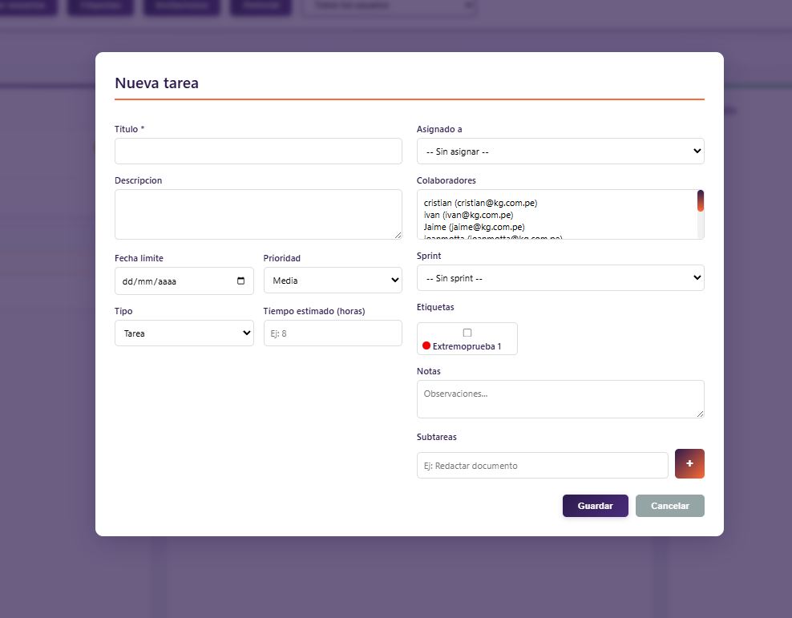
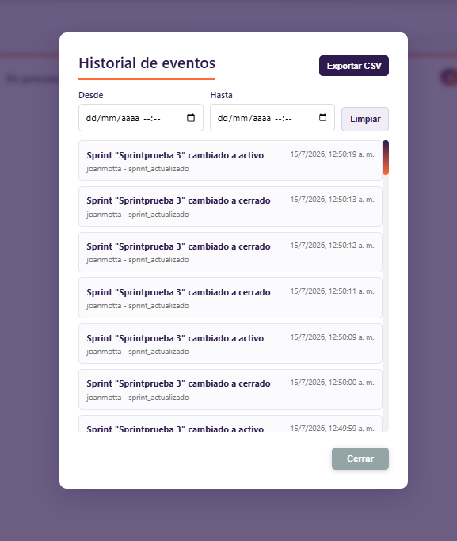
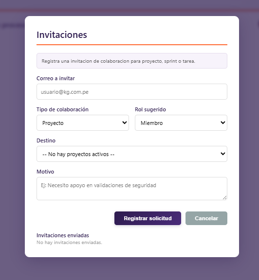
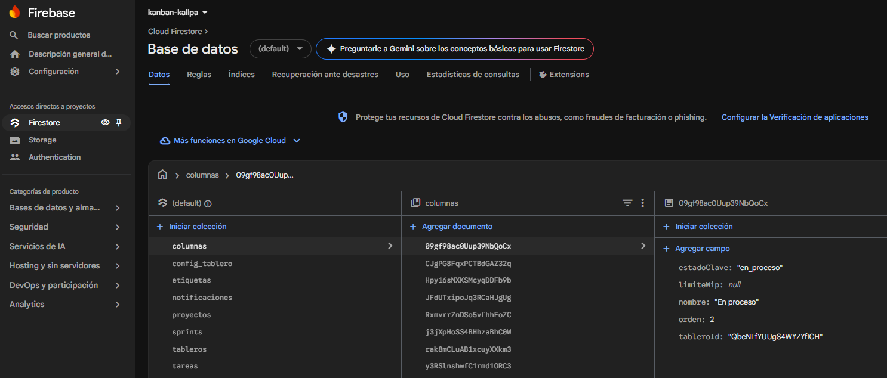

# Tablero Kanban - Arquitectura TI

Sistema web tipo Kanban orientado a la gestion de proyectos, sprints, tareas y trazabilidad para un area de Arquitectura TI.

## Descripcion

El proyecto permite organizar el trabajo por proyectos, sprints y tareas, asignando responsables, colaboradores, prioridades, fechas, subtareas, comentarios, adjuntos, tiempo registrado e historial de actividad.

Esta pensado para un entorno universitario y empresarial basico, donde existen roles como administrador, lider, miembro e invitado.

## Tecnologias

- HTML5
- CSS3
- JavaScript modular
- Firebase Authentication
- Cloud Firestore
- GitHub

## Funcionalidades principales

- Inicio de sesion con Firebase.
- Gestion de usuarios y roles.
- Creacion y gestion de proyectos.
- Gestion de sprints por proyecto.
- Tablero Kanban con columnas:
  - Pendiente
  - En proceso
  - Terminado
- Creacion y edicion de tareas.
- Asignacion de responsable y colaboradores.
- Tipos de tarea:
  - Tarea
  - Bug
  - Mejora
  - Investigacion
- Prioridades:
  - Alta
  - Media
  - Baja
- Subtareas con avance visual.
- Comentarios por tarea.
- Adjuntos por tarea.
- Registro de tiempo.
- Historial de eventos.
- Filtro de historial por fecha y hora.
- Exportacion del historial en CSV.
- Notificaciones internas.
- Solicitudes de colaboracion por proyecto, sprint o tarea.
- Validaciones de fechas y capacidades.
- Cierre y reapertura de proyectos.

## Roles del sistema

| Rol | Permisos principales |
| --- | --- |
| Administrador | Gestiona usuarios, proyectos, sprints, tareas, historial, invitaciones y eliminaciones. |
| Lider | Gestiona proyectos, sprints, tareas, asignaciones, colaboradores e invitaciones. |
| Miembro | Visualiza y actualiza tareas asignadas o donde participa como colaborador. |
| Invitado | Acceso limitado segun reglas del sistema. |

## Estructura funcional

```text
Proyecto
|-- Miembros
|-- Roles
|-- Etiquetas
|-- Columnas
|-- Configuracion
|-- Sprints
|   |-- Objetivo
|   |-- Estado
|   |-- Responsable
|   |-- Fechas
|   |-- Capacidad
|   |-- Participantes
|   |-- Tareas
|       |-- Titulo
|       |-- Descripcion
|       |-- Prioridad
|       |-- Estado
|       |-- Responsable
|       |-- Colaboradores
|       |-- Fecha limite
|       |-- Etiquetas
|       |-- Comentarios
|       |-- Adjuntos
|       |-- Tiempo estimado
|       |-- Tiempo registrado
|       |-- Subtareas
|-- Historial de actividad
```

## Colecciones principales en Firestore

- `usuarios`
- `tableros`
- `columnas`
- `proyectos`
- `sprints`
- `tareas`
- `etiquetas`
- `notificaciones`
- `invitaciones`
- `roles_permisos`
- `config_tablero`

Subcolecciones usadas:

- `tareas/{tareaId}/subtareas`
- `tareas/{tareaId}/comentarios`
- `tareas/{tareaId}/adjuntos`
- `tareas/{tareaId}/tiempo_registrado`
- `tableros/{tableroId}/actividad`

## Validaciones implementadas

- La fecha fin de un proyecto no puede ser anterior a la fecha de inicio.
- Las fechas de un sprint deben estar dentro del rango del proyecto.
- La fecha limite de una tarea debe estar dentro del sprint o proyecto correspondiente.
- La capacidad del sprint no puede superar sus horas calendario ni la capacidad del proyecto.
- La capacidad del proyecto no puede superar las horas disponibles de sus miembros.
- Una tarea no puede exceder la capacidad del sprint o proyecto.
- Al mover una tarea a terminado, se advierte si tiene subtareas pendientes.
- Un proyecto cerrado queda en modo consulta y bloquea nuevas tareas o sprints.

## Capturas del sistema

### Inicio de sesion



### Tablero Kanban



### Gestion de proyectos



### Gestion de sprints



### Modal de tarea



### Historial de eventos



### Invitaciones y solicitudes



### Colecciones en Firestore



## Como ejecutar el proyecto

1. Clonar el repositorio.
2. Abrir la carpeta del proyecto.
3. Configurar Firebase en `js/firebase-config.js`.
4. Ejecutar con Live Server o un servidor local.
5. Abrir `index.html` para iniciar sesion.

Ejemplo con Python:

```powershell
python -m http.server 8087
```

Luego abrir:

```text
http://localhost:8087/index.html
```

## Datos de prueba sugeridos

Proyecto:

```text
Modernizacion de Arquitectura de Autenticacion
Fecha inicio: 15/07/2026
Fecha fin estimada: 31/07/2026
Responsable: ivan@kg.com.pe
Capacidad: 320 horas
```

Sprints:

```text
Sprint 1 - Analisis y Diseno
15/07/2026 - 19/07/2026
Capacidad: 120 horas

Sprint 2 - Implementacion Base
20/07/2026 - 25/07/2026
Capacidad: 140 horas

Sprint 3 - Seguridad y Trazabilidad
26/07/2026 - 31/07/2026
Capacidad: 120 horas
```

## Autor

Proyecto desarrollado por Jaime Galvez para la gestion de un tablero Kanban orientado al area de Arquitectura TI.
